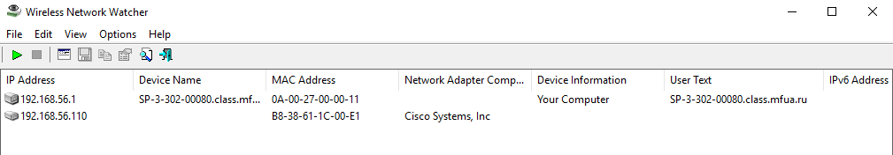
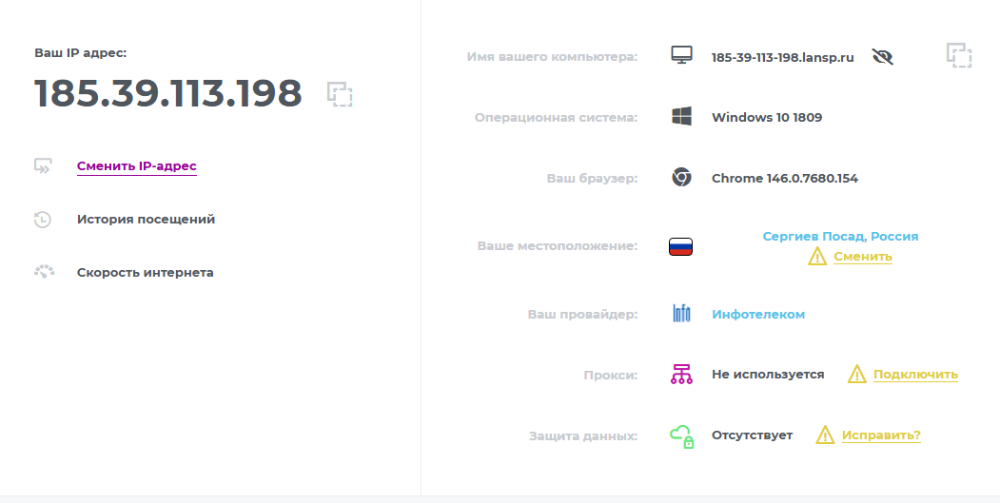

# Задание 1
Определить IP-адрес локального (своего) компьютера, подключенного к сети.
Для определения IP-адреса своего компьютера в операционной
системе MS Windows необходимо воспользоваться утилитой IPCONFIG.
Для запуска данной программы необходимо выполнить команду ipconfig
в режиме командной строки. При выполнении данной команды на экране
монитора компьютера будет выведена основная конфигурация TCP/IP для всех сетевых адаптеров 

Для получения более полной информации выполните команду
ipconfig /all.

```
C:\Users\29446717.CLASS>ipconfig

Настройка протокола IP для Windows


 Адаптер Ethernet Ethernet 2:

   DNS-суффикс подключения . . . . . :
   Локальный IPv6-адрес канала . . . : fe80::6acb:26fa:29c0:cd94%17
   IPv4-адрес. . . . . . . . . . . . : 192.168.56.1
   Маска подсети . . . . . . . . . . : 255.255.255.0
   Основной шлюз. . . . . . . . . :

Адаптер Ethernet Ethernet 3:

   DNS-суффикс подключения . . . . . : mfua.ru
   Локальный IPv6-адрес канала . . . : fe80::daaa:d6a4:61af:11ed%13
   IPv4-адрес. . . . . . . . . . . . : 192.168.129.39
   Маска подсети . . . . . . . . . . : 255.255.255.0
   Основной шлюз. . . . . . . . . : 192.168.129.254

C:\Users\29446717.CLASS>ipconfig /all

Настройка протокола IP для Windows

   Имя компьютера  . . . . . . . . . : SP-3-306-00018
   Основной DNS-суффикс  . . . . . . : class.mfua.ru
   Тип узла. . . . . . . . . . . . . : Гибридный
   IP-маршрутизация включена . . . . : Нет
   WINS-прокси включен . . . . . . . : Нет
   Порядок просмотра суффиксов DNS . : class.mfua.ru
                                       mfua.ru

Адаптер Ethernet Ethernet 2:

   DNS-суффикс подключения . . . . . :
   Описание. . . . . . . . . . . . . : VirtualBox Host-Only Ethernet Adapter
   Физический адрес. . . . . . . . . : 0A-00-27-00-00-11
   DHCP включен. . . . . . . . . . . : Нет
   Автонастройка включена. . . . . . : Да
   Локальный IPv6-адрес канала . . . : fe80::6acb:26fa:29c0:cd94%17(Основной)
   IPv4-адрес. . . . . . . . . . . . : 192.168.56.1(Основной)
   Маска подсети . . . . . . . . . . : 255.255.255.0
   Основной шлюз. . . . . . . . . :
   IAID DHCPv6 . . . . . . . . . . . : 168427559
   DUID клиента DHCPv6 . . . . . . . : 00-01-00-01-28-EC-7C-06-A8-A1-59-70-82-91
   DNS-серверы. . . . . . . . . . . : fec0:0:0:ffff::1%1
                                       fec0:0:0:ffff::2%1
                                       fec0:0:0:ffff::3%1
   NetBios через TCP/IP. . . . . . . . : Включен

Адаптер Ethernet Ethernet 3:

   DNS-суффикс подключения . . . . . : mfua.ru
   Описание. . . . . . . . . . . . . : Intel(R) 82579LM Gigabit Network Connection
   Физический адрес. . . . . . . . . : 44-37-E6-88-22-3A
   DHCP включен. . . . . . . . . . . : Да
   Автонастройка включена. . . . . . : Да
   Локальный IPv6-адрес канала . . . : fe80::daaa:d6a4:61af:11ed%13(Основной)
   IPv4-адрес. . . . . . . . . . . . : 192.168.129.39(Основной)
   Маска подсети . . . . . . . . . . : 255.255.255.0
   Аренда получена. . . . . . . . . . : 25 марта 2026 г. 9:17:37
   Срок аренды истекает. . . . . . . . . . : 4 апреля 2026 г. 9:17:38
   Основной шлюз. . . . . . . . . : 192.168.129.254
   DHCP-сервер. . . . . . . . . . . : 192.168.129.254
   IAID DHCPv6 . . . . . . . . . . . : 491010022
   DUID клиента DHCPv6 . . . . . . . : 00-01-00-01-28-EC-7C-06-A8-A1-59-70-82-91
   DNS-серверы. . . . . . . . . . . : 10.88.34.5
                                       10.88.34.6
   NetBios через TCP/IP. . . . . . . . : Включен 
   
```
# Задание 2
Определить имя узла компьютера в локальной сети.
Для определения имени узла компьютера в локальной сети необходимо
использовать утилиту HOSTNAME. После выполнения команды hostname в
режиме командной строки на экран монитора выводится информация об
имени узла компьютера в локальной сети 

```
 C:\Users\29446717.CLASS>HOSTNAME
SP-3-306-00018
```

# Задание 3
Определить скорость передачи информации в компьютерной сети и
наличие связи с узлом.
Проверить наличие пути до заданного узла и определить временные
характеристики этого пути можно, используя утилиту PING, которая
тестирует сетевое соединение путем посылки ICMP-пакетов типа «запрос
эха», на которые получатель отвечает ICMP-пакетом типа «эхо-ответ».
Утилите PING достаточно указать IP-адрес или DNS-имя, однако имеется ряд
ключей, позволяющих более тонко управлять ее работой (перечень выводится
на экран без указания в утилите IP-адреса или DNS-имени). Утилита PING
выводит результат каждого запроса/ответа на отдельной строке, а перед за-
вершением работы выдает статистику: минимальное, максимальное и среднее
время передачи пакета, количество и долю потерянных пакетов. Фактически
PING является основной утилитой при тестировании сетевых соединений.
При использовании утилиты PING совместно с ключом «-t» можно для тестирования скорости передачи информации неограниченное число пакетов. Например, при выполнении в командной
строке команды ping –t ip_address (ключ –t отделяется пробелом от команды
ping, ip_address – IP-адрес (или DNS-имя) компьютера, который используется
для тестирования связи), будет происходить постоянная отправка пакетов и
можно обнаружить ситуацию, при которой появляется или пропадает связь.
Если ответ не пришел в течение определенного времени, то считается, что
между двумя устройствами отсутствует линия связи. Если в командной строке
ввести команду ping 127.0.0.1 (127.0.0.1 — IP-адрес специального сетевого
интерфейса в сетевом протоколе TCP/IP и обозначает, то же самое сетевое
устройство (компьютер), с которого осуществляется отправка сетевого пакета
или установление соединения). 
Использование адреса 127.0.0.1 позволяет устанавливать соединение и передавать информацию для программ-серверов,
работающим на том же компьютере, что и программа-клиент, независимо от
конфигурации аппаратных сетевых средств компьютера.
Это дает возможность протестировать корректность работы самой
утилиты 

```
C:\Users\29446717.CLASS>ping 127.0.0.1

Обмен пакетами с 127.0.0.1 по с 32 байтами данных:
Ответ от 127.0.0.1: число байт=32 время<1мс TTL=128
Ответ от 127.0.0.1: число байт=32 время<1мс TTL=128
Ответ от 127.0.0.1: число байт=32 время<1мс TTL=128
Ответ от 127.0.0.1: число байт=32 время<1мс TTL=128

Статистика Ping для 127.0.0.1:
    Пакетов: отправлено = 4, получено = 4, потеряно = 0
    (0% потерь)
Приблизительное время приема-передачи в мс:
    Минимальное = 0мсек, Максимальное = 0 мсек, Среднее = 0 мсек
```

Обычно для тестирования скорости передачи информации отправляется
четыре цифровых пакета по 32 байта каждый и определяется приблизительное
время приема–передачи в миллисекундах (мс). Особенно важен параметр
(время приема–передачи) для мультимедийных приложений, сетевых (on-line)
игр и т.д. Для этих приложений этот параметр должен быть не более 500 мс.
Если этот параметр менее 200 мс, то связь с сервером считается очень
хорошей, если параметр больше 200 мс, то связь будет удовлетворительной
или неудовлетворительной.
Для проверки наличия связи с узлом KLGTU.RU введем команду ping
klgtu.ru 


```
C:\Users\29446717.CLASS>ping klgtu.ru

Обмен пакетами с klgtu.ru [62.141.122.126] с 32 байтами данных:
Ответ от 62.141.122.126: число байт=32 время=32мс TTL=247
Ответ от 62.141.122.126: число байт=32 время=31мс TTL=247
Ответ от 62.141.122.126: число байт=32 время=30мс TTL=247
Ответ от 62.141.122.126: число байт=32 время=30мс TTL=247

Статистика Ping для 62.141.122.126:
    Пакетов: отправлено = 4, получено = 4, потеряно = 0
    (0% потерь)
Приблизительное время приема-передачи в мс:
    Минимальное = 30мсек, Максимальное = 32 мсек, Среднее = 30 мсек
```
PING YANDEX.RU

```
C:\Users\29446717.CLASS>ping yandex.ru

Обмен пакетами с yandex.ru [77.88.55.88] с 32 байтами данных:
Ответ от 77.88.55.88: число байт=32 время=14мс TTL=249
Ответ от 77.88.55.88: число байт=32 время=14мс TTL=249
Ответ от 77.88.55.88: число байт=32 время=14мс TTL=249
Ответ от 77.88.55.88: число байт=32 время=14мс TTL=249

Статистика Ping для 77.88.55.88:
    Пакетов: отправлено = 4, получено = 4, потеряно = 0
    (0% потерь)
Приблизительное время приема-передачи в мс:
    Минимальное = 14мсек, Максимальное = 14 мсек, Среднее = 14 мсек
```
PING MICROSOFT.COM

```
C:\Users\29446717.CLASS>ping microsoft.com

Обмен пакетами с microsoft.com [13.107.226.44] с 32 байтами данных:
Превышен интервал ожидания для запроса.
Превышен интервал ожидания для запроса.
Превышен интервал ожидания для запроса.
Превышен интервал ожидания для запроса.

Статистика Ping для 13.107.226.44:
    Пакетов: отправлено = 4, получено = 0, потеряно = 4
    (100% потерь)
```

# Задание 4
Определить маршрут пакетов до заданного узла и получить временные
характеристики для каждого промежуточного маршрутизатора на этом пути.
Выявлять последовательность маршрутизаторов, через которые проходит
IP-пакет на пути к пункту своего назначения и время задержки на каждом из них позволяет утилита TRACERT. Для выполнения утилиты необходимо
указать IP-адрес или DNS-имя конечного узла. Более тонко управлять ее
работой позволяют ключи (перечень выводится на экран без указания в
утилите IP-адреса или DNS-имени). Утилита, как и ранее описанная PING,
отправляет серию пакетов ICMP с разными значениями TTL (Time to live). В
вычислительной технике и компьютерных сетях — предельный период
времени или число итераций, или переходов, за который набор данных (пакет)
может существовать до своего исчезновения.
Для каждого пакета на экране отображается величина интервала времени
между отправкой пакета и получением ответа. Символ «*» означает, что ответ
на данный пакет не был получен. Если узел не отвечает, то при превышении
интервала ожидания ответа выдается сообщение «Превышен интервал
ожидания для запроса». Интервал ожидания ответа может быть изменен с
помощью ключа «–w» команды TRACERT. Для трассировки маршрута до
узла KLGTU.RU выполним команду tracert klgtu.ru 
```
C:\Users\29446717.CLASS>tracert klgtu.ru

Трассировка маршрута к klgtu.ru [62.141.122.126]
с максимальным числом прыжков 30:

  1     1 ms    <1 мс     2 ms  192.168.129.254
  2   121 ms     3 ms     1 ms  185-39-113-193.lansp.ru [185.39.113.193]
  3     1 ms     1 ms     1 ms  92-43-167-23.lansp.ru [92.43.167.23]
  4     *       11 ms    11 ms  185.39.112.97
  5     *       18 ms    21 ms  188.43.237.30
  6    14 ms    10 ms    10 ms  195.190.101.90
  7    12 ms    11 ms    11 ms  195.190.101.89
  8    28 ms    28 ms    29 ms  79.104.249.113
  9    31 ms    30 ms    31 ms  62.141.122.126

Трассировка завершена.
```
Трассировка маршрута до узла YANDEX.RU

```
C:\Users\29446717.CLASS>tracert yandex.ru

Трассировка маршрута к yandex.ru [77.88.44.55]
с максимальным числом прыжков 30:

  1     1 ms     1 ms    <1 мс  192.168.129.254
  2     1 ms     1 ms     1 ms  185-39-113-193.lansp.ru [185.39.113.193]
  3     1 ms     1 ms     1 ms  92-43-167-23.lansp.ru [92.43.167.23]
  4    11 ms    10 ms    13 ms  border.lansp.ru [185.39.112.97]
  5     4 ms     3 ms     4 ms  mskn17ra.transtelecom.net [188.43.237.30]
  6    10 ms    10 ms    10 ms  Yandex-gw.transtelecom.net [188.43.215.169]
  7    10 ms    13 ms     9 ms  Yandex-gw.transtelecom.net [188.43.215.170]
  8     *        *        *     Превышен интервал ожидания для запроса.
  9     *        *        *     Превышен интервал ожидания для запроса.
 10    21 ms    21 ms    21 ms  yandex.ru [77.88.44.55]

Трассировка завершена.
```

# Задание 5

Определить
соответствие
локального
IP-адреса,
(аппаратному) адресу в локальной сети.
Возможность просматривать и изменять ARP-таблицу, в которой
хранятся пары «МАС-адрес - IP-адрес» для тех узлов, с которыми в недавнем
происходил обмен данными, дает утилита ARP. Эта таблица формируется
автоматически при работе сетевого узла, но администратор сети может
вносить в нее записи вручную.
Узел, собирающийся отправить сообщение другому узлу, должен
предварительно узнать MAC адрес получателя сообщения. Для решения
данной задачи узел применяет технологию ARP, отправляя запрос узлам своей
локальной сети. Данный ARP запрос содержит IP адрес получателя. Из всех
узлов,
получивших
данный
запрос,
отвечает
лишь
соответствующий IP адрес. В своем ответе (ARP отклике) этот узел сообщает
свой MAC адрес. И лишь после этого первый узел сможет отправить ему свое
сообщение.
Компьютеры
чаще
всего
отправляют
маршрутизатору и, следовательно, в своих ARP запросах они указывают
адрес основного шлюза. Для уменьшения ARP трафика компьютеры хранят в
своей памяти таблицу с IP и MAC адресами тех устройств, с которыми они в
последнее время обменивались сообщениями. Управление работой утилиты
возможно с помощью ключей (перечень выводится на экран командой arp).
Утилита ARP с ключом -a позволяет вывести на экран всю ARP-таблицу.
Выполним команду arp -a 

```
C:\Users\29446717.CLASS>arp -a

Интерфейс: 192.168.129.39 --- 0xd
  адрес в Интернете      Физический адрес      Тип
  192.168.129.1         e4-c3-2a-5c-46-01     динамический
  192.168.129.4         00-15-5d-81-3d-07     динамический
  192.168.129.32        24-be-05-05-72-dc     динамический
  192.168.129.52        88-51-fb-46-fd-2d     динамический
  192.168.129.72        b4-b5-2f-a9-09-ee     динамический
  192.168.129.254       b8-38-61-1c-00-e1     динамический
  192.168.129.255       ff-ff-ff-ff-ff-ff     статический
  224.0.0.22            01-00-5e-00-00-16     статический
  224.0.0.251           01-00-5e-00-00-fb     статический
  224.0.0.252           01-00-5e-00-00-fc     статический
  239.255.255.250       01-00-5e-7f-ff-fa     статический
  255.255.255.255       ff-ff-ff-ff-ff-ff     статический

Интерфейс: 192.168.56.1 --- 0x11
  адрес в Интернете      Физический адрес      Тип
  192.168.56.255        ff-ff-ff-ff-ff-ff     статический
  224.0.0.22            01-00-5e-00-00-16     статический
  224.0.0.251           01-00-5e-00-00-fb     статический
  224.0.0.252           01-00-5e-00-00-fc     статический
  255.255.255.255       ff-ff-ff-ff-ff-ff     статический
```

Задание 6
Wireless Network Watcher - бесплатная утилита, которая сканирует
беспроводные сети и отображает список всех подключенных в данный момент
компьютеров
и
устройств.
Для
каждого
обнаруженного
устройства
отображается такая информация, как IP- и MAC-адрес, название компании
производителя и имя компьютера или устройства. Скопируем утилиту на свой
компьютер (прилагается к методическим указаниям) и выполним команду
WNetWatcher.exe 

Дополнительная
информация
(в
столбцах, которые не показаны на рисунке) содержит сведения о времени и
числе обнаружений устройства в сети, его активности в настоящий момент
времени. Используя ранее изученную сетевую утилиту PING определить
скорость передачи информации в компьютерной сети и наличие связи с подключенными устройствами (узлами) беспроводной сети



Результат сканирования беспроводной сети

```
C:\Users\29446717.CLASS>ping 192.168.56.1

Обмен пакетами с 192.168.56.1 по с 32 байтами данных:
Ответ от 192.168.56.1: число байт=32 время<1мс TTL=128
Ответ от 192.168.56.1: число байт=32 время<1мс TTL=128
Ответ от 192.168.56.1: число байт=32 время<1мс TTL=128
Ответ от 192.168.56.1: число байт=32 время<1мс TTL=128

Статистика Ping для 192.168.56.1:
    Пакетов: отправлено = 4, получено = 4, потеряно = 0
    (0% потерь)
Приблизительное время приема-передачи в мс:
    Минимальное = 0мсек, Максимальное = 0 мсек, Среднее = 0 мсек
```

# Задача 7
WifiInfoView - небольшая бесплатная утилита, которая сканирует
ближайшие беспроводные сети, и отображает массу полезной информации,
как например имя сети (SSID), MAC-адрес, тип PHY (802.11 g/n), мощность и
качество сигнала, используемая частота, номер канала, максимальная
скорость, модель маршрутизатора, наличие или отсутствие пароля и многое
другое. В нижней панели главного окна WifiInfoView отображается
полученная
информация,
которая
представлена
в
формате. Также присутствует возможность группировать обнаруженные
беспроводные сети по номеру канала, модели маршрутизатора, типу PHY или
максимальной скорости. Скопируем утилиту на свой компьютер (прилагается
к методическим указаниям) и выполним команду WifiInfoView.exe
# НЕТ АДАПТЕРА

# Задача 8 
2IP Интернет-сайт — набор интернет-сервисов.
2ip.ru — сайт, предоставляет пользователю множество сервисов:
возможность узнать IP-адрес компьютера, проверку скорости соединения,
проверку открытия порта, получение информации об интернет-ресурсах (IP и
т. д.) и др. Также на сайте присутствует рейтинг провайдеров. При заходе на
2ip.ru – бонусом к функции определения IP предоставляется обзор дополнительных данных об ОС, браузере, месте расположения и интернет-
провайдере




# Контрольные вопросы

## Какой формат имени сетевого ресурса может использоваться при обращении к нему?

В компьютерных сетях, в частности в стеке протоколов TCP/IP, для обращения к сетевому ресурсу используются символьные (доменные) имена. Они имеют иерархическую структуру, как указано в главе 13. Примером такого имени является www.olifer.co.uk. Для точной идентификации ресурса в сети также используются числовые (IP-адреса), но для людей удобнее символьные имена.

## Какой протокол необходим для работы с утилитой ping? Найти описание и характеристики протокола.

Для работы утилиты ping необходим протокол ICMP (Internet Control Message Protocol). Описание и характеристики этого протокола приведены в главе 14 ("Протокол межсетевого взаимодействия IP"), в разделе "Протокол ICMP".

Основные характеристики:

Назначение: Это вспомогательный протокол, используемый для диагностики и мониторинга сети. Он предназначен для оповещения отправителя об ошибках, возникших при передаче пакета (например, истечение времени жизни, недостижимость узла).

Работа с ping: Утилита ping использует пару сообщений ICMP: эхо-запрос (тип 8) и эхо-ответ (тип 0). Хост отправляет эхо-запрос, а узел назначения, получив его, формирует и отправляет обратно эхо-ответ. Успешный обмен этими сообщениями свидетельствует о нормальном функционировании транспортной системы сети.

Формат: Сообщение ICMP состоит из 8-байтного заголовка (поля "тип", "код", "контрольная сумма") и поля данных, структура которого зависит от типа сообщения.

Особенность: ICMP компенсирует ненадежность протокола IP, но не исправляет ошибки, а лишь сообщает о них.
## Зачем используется параметр all в утилите ipconfig?

В предоставленном файле учебника утилита ipconfig не упоминается. Однако, основываясь на общих знаниях о сетевых утилитах Windows, можно ответить, что параметр all (команда ipconfig /all) используется для отображения полной и подробной конфигурации всех сетевых интерфейсов компьютера.

В отличие от простого ipconfig, который показывает только IP-адрес, маску подсети и основной шлюз, ipconfig /all выводит дополнительную информацию:

Физический (MAC) адрес адаптера.

Адреса DNS-серверов.

Включен ли протокол DHCP и адрес DHCP-сервера.

Время получения и истечения аренды IP-адреса.

Состояние интерфейса (активен или отключен).

## Каким образом утилиты ping и tracert осуществляют прослеживание маршрутов пакетов к заданному узлу?

Способы прослеживания маршрутов у этих утилит различаются:

tracert (или traceroute в Unix): Осуществляет трассировку, как описано в главе 14 ("Протокол ICMP"), используя поле времени жизни (Time To Live, TTL) в заголовке IP-пакета.

Утилита отправляет первый пакет с TTL = 1. Первый маршрутизатор на пути уменьшает TTL до 0, отбрасывает пакет и отправляет отправителю ICMP-сообщение об истечении времени (тип 11).
Затем отправляется пакет с TTL = 2. Первый маршрутизатор пропускает его, а второй, уменьшив TTL до 0, отправляет ICMP-сообщение об ошибке.
Процесс повторяется, постепенно увеличивая TTL, пока пакет не достигнет узла назначения. Таким образом, tracert собирает IP-адреса всех промежуточных маршрутизаторов.
ping: Сама по себе утилита ping не осуществляет прослеживание маршрутов. Она лишь проверяет достижимость конечного узла, отправляя ICMP-эхо-запросы. Однако в некоторых операционных системах (например, в Windows) существует опция -i (или -j для маршрутизации от источника), которая позволяет изменить значение TTL, но она не предоставляет автоматическую трассировку, как tracert. Для прослеживания маршрута в Unix-подобных системах используется traceroute, а в Windows — tracert.

## Можно ли утилитой tracert задать максимальное число ретрансляций?

Да, это возможно. Утилита tracert (и ее Unix-аналог traceroute) позволяет задать максимальное количество ретрансляций (хопов). В Windows для этого используется параметр -h (например, tracert -h 15 google.com), что ограничит трассировку максимум 15 переходами. Это позволяет контролировать, насколько далеко в сети будет производиться поиск маршрута.

## Что такое localhost?

localhost — это стандартное доменное имя, зарезервированное для обращения к текущему локальному компьютеру, как описано в главе 13 ("Адресация в стеке протоколов TCP/IP"). Это имя служит псевдонимом для специального IP-адреса обратной петли (loopback).

В IPv4 этот адрес — 127.0.0.1, а в IPv6 — ::1. При использовании localhost данные не отправляются в сеть, а возвращаются обратно в стек протоколов того же компьютера. Это используется для тестирования программного обеспечения и сетевых служб на локальной машине, а также для взаимодействия клиентской и серверной частей приложения, установленных на одном компьютере.

