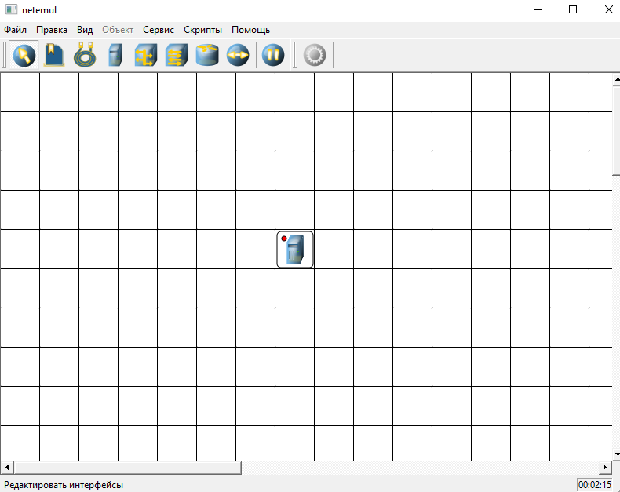
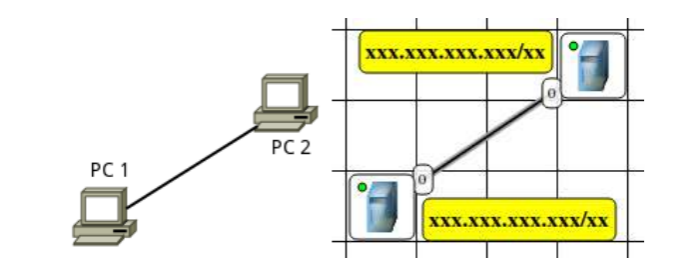
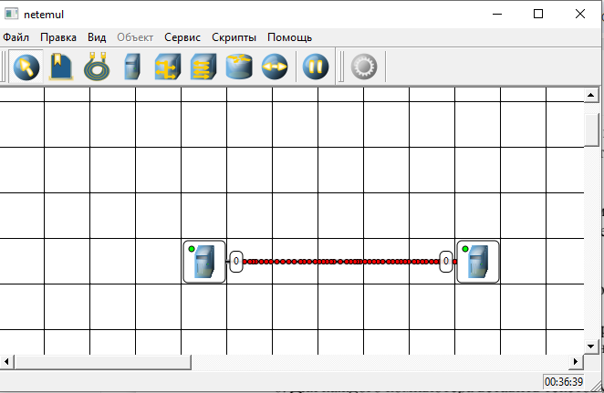
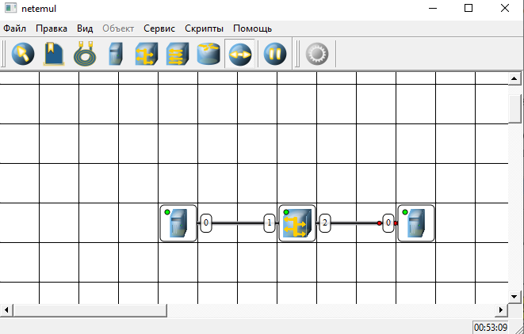
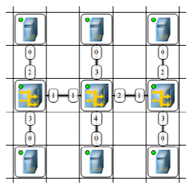
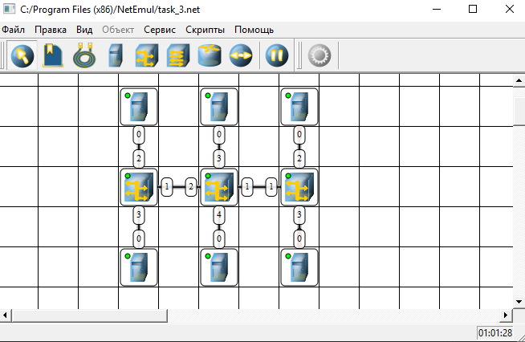

# Лабораторная работа №3
# Задание 1
Приложение позволяет создавать сети без каких-либо ограничений.
Верхняя панель инструментов содержит значки всех объектов, которые можно
разместить в рабочей области. Выбор объекта и его размещение в сетке
рабочей области выполняется стандартными манипуляциями с компьютерной
мышью. Объектами могут быть компьютеры, концентраторы, коммутаторы,
маршрутизаторы, соединительные кабели и текстовые поля для ввода надписи
или комментария.
После
выбора
и
размещения
объектов
выполняется
настройка
соединений, перетаскиванием линий от одного объекта к другому. Все
необходимые для построения сети инструменты, а также кнопки Отправки
сообщений и Запустить/Остановить размещены на Панели устройств. При
корректном соединении устройств на каждом конце соединения показан
номер используемого интерфейса, а на иконке устройства индикатор
соединения меняет цвет с красного на желтый (соединение есть, но
интерфейсы не настроены). На Панели параметров расположены свойства
объектов. Для выделенного объекта появляются только те свойства, которые
характерны для него. Настройку параметров работы конкретного узла можно
выполнить в контекстном меню (нажатие правой кнопки мыши на значке
узла).
Завершенный проект сети может быть напечатан или сохранен в
определенном формате (.net) для последующего использования.
Для проведения анализа работы сети в приложении возможно присвоение
адресов всем объектам, отправление пакетов данных с одного компьютера на
другой, определение пути и скорости передачи данных.
В
меню
программы
Помощь
приведено
подробное
руководство
пользователя.

# Задание 2

Выполнить команду Файл-Новый, чтобы нарисовать схему сети как
показано на Рисунке

# Задание 3
1 Выполнить команду Файл-Новый, чтобы нарисовать схему сети как
показано на Рисунке 5
2 Добавить на рабочее поле два компьютера и концентратор, соединить
устройства, как показано на Рисунке 5, настроить сетевые интерфейсы
компьютеров,
задав
IP-адреса
и
маски
подсети,
добавить
рядом
устройствами соответствующие надписи.
3 Проверить работоспособность смоделированной сети, передав пакеты
данных (TCP, 5KB) между компьютерами.
4 Проследить за перемещением пакетов и сделать выводы об
особенностях работы компьютерной сети с концентратором.

# Задание 3
Моделирование ЛВС на концентраторах
Выполнить команду Файл-><!--  -->Новый, чтобы нарисовать схему сети как
показано на Рисунке 

# Контрольные вопросы

## 1) Какие виды программ используются для моделирования компьютерных сетей?
    Для моделирования компьютерных сетей используются такие виды программ, как симуляторы, эмуляторы и аналитические средства. Симуляторы, например NS-2, NS-3 или OMNeT++, позволяют воспроизвести поведение сети на основе математических моделей событий и времени. Эмуляторы, в частности GNS3 или Eve-NG, работают с реальными образами операционных систем сетевых устройств, обеспечивая высокую точность. Также применяются аналитические пакеты, например MATLAB с расширениями для телетрафика, и специализированные средства вроде Cisco Packet Tracer для образовательных целей. 
 ## 2) Что такое IP-адрес?
    IP-адрес представляет собой уникальный числовой идентификатор, который присваивается каждому устройству для участия в компьютерной сети, работающей по протоколу IP. Он выполняет две основные функции: идентификацию устройства (узла) и указание его местоположения в сети, то есть адресацию. В наиболее распространённой версии протокола IPv4 адрес состоит из тридцати двух битов и для удобства человека записывается в виде четырёх десятичных чисел от нуля до двухсот пятидесяти пяти, разделённых точками. Также существует версия IPv6, использующая сто двадцать восемь битов и записываемая в шестнадцатеричной системе с двоеточиями, что решает проблему исчерпания адресов. IP-адрес может быть статическим, то есть назначенным навсегда, или динамическим, получаемым от сервера DHCP на ограниченное время. При этом адреса делятся на частные, предназначенные для локальных сетей и не маршрутизируемые в глобальной сети, и публичные, уникальные во всём интернете.
## 3) Что такое маска подсети?
    Маска подсети — это тридцатидвухбитовое число, используемое в паре с IP-адресом для разделения этого адреса на две логические части: идентификатор сети и идентификатор узла. В двоичном представлении маска всегда состоит из непрерывной последовательности единиц, которые показывают, какая часть IP-адреса относится к адресу сети, и следующей за ними последовательности нулей, определяющей адрес конкретного устройства внутри этой сети. Применяя операцию логического умножения между IP-адресом и маской подсети, устройство получает адрес сети, что позволяет определить, находится ли целевой узел в той же локальной сети, что и отправитель, или для связи с ним необходимо использовать маршрутизатор. Для удобства маску часто записывают в том же десятичном формате, что и IP-адрес, например две пять пять, две пять пять, две пять пять, ноль, или используют префиксную нотацию в виде слеша и количества единичных битов, например слеш двадцать четыре. Корректное назначение маски подсети является необходимым условием для построения любых логических сетевых сегментов и обеспечения маршрутизации.
## 4) Как работает концентратор?
    Концентратор, или хаб, работает на физическом уровне сетевой модели OSI, являясь простейшим пассивным устройством для объединения компьютеров в локальную сеть. Получив электрический сигнал на одном из своих портов, концентратор не анализирует адреса получателей и не выполняет никакой обработки данных, а просто ретранслирует этот сигнал на все остальные активные порты, кроме того, с которого сигнал пришёл. В результате любой пакет данных, отправленный одним компьютером, попадает на все остальные компьютеры, подключённые к данному хабу. Такая логика работы приводит к постоянному разделению пропускной способности между всеми активными узлами и создаёт высокую вероятность коллизий, то есть одновременной передачи данных несколькими устройствами. В современных сетях концентраторы практически полностью вытеснены коммутаторами, которые, в отличие от хаба, работают на канальном уровне и умеют направлять трафик только на порт, ведущий к конкретному адресату.
## 5) Какие особенности обмена данными в ЛВС на основе концентраторов?
    В локальных сетях на основе концентраторов обмен данными характеризуется использованием общей разделяемой среды, где все устройства подключены к единому логическому сегменту сети. Каждый кадр данных, отправленный любой рабочей станцией, передаётся концентратором на все остальные порты, что приводит к тому, что все узлы сети получают этот трафик независимо от того, кому он адресован. Вследствие этого возникает необходимость в прослушивании эфира и фильтрации пакетов на уровне сетевых адаптеров, которые игнорируют данные, предназначенные не для них. При одновременной попытке передачи данных двумя или более устройствами происходит коллизия, и сигналы накладываются друг на друга, искажая информацию. Для разрешения таких ситуаций используется метод множественного доступа с контролем несущей и обнаружением коллизий, или CSMA/CD, предписывающий устройствам прекратить передачу и возобновить её через случайный интервал времени. Из-за роста числа коллизий с увеличением количества узлов или интенсивности трафика фактическая пропускная способность сети существенно снижается по сравнению с номинальной, а общий домен коллизий охватывает все подключённые устройства.