# Лабараторная № 4

## Задание 1
В каталоге Temp создать дерево каталогов по
вариантам как показано в вариантах заданий с использованием
команд табл. 1.
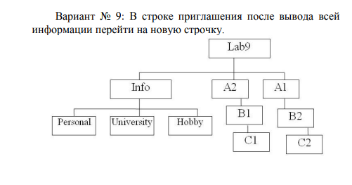
Вариант 9

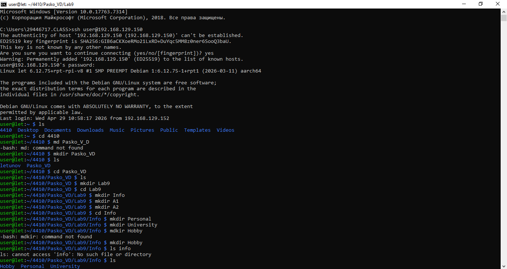
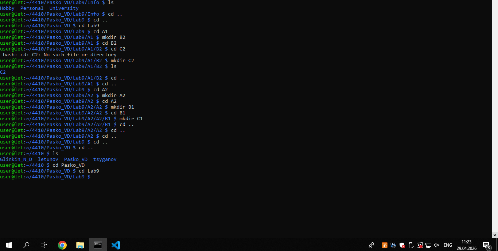

## Задание 2

В каталоге А2 создать подкаталоги В4 и В5 и удалить
каталог В2.

` -NULL-`

## Задание 3
В каталоге Personal создать файл Name.txt,
содержащий информацию о фамилии, имени и отчестве
студента. Здесь же создать файл Date.txt, содержащий
информацию о дате рождения студента. В этом же каталоге
создать файл School.txt, содержащий информацию о школе,
которую закончил студент.

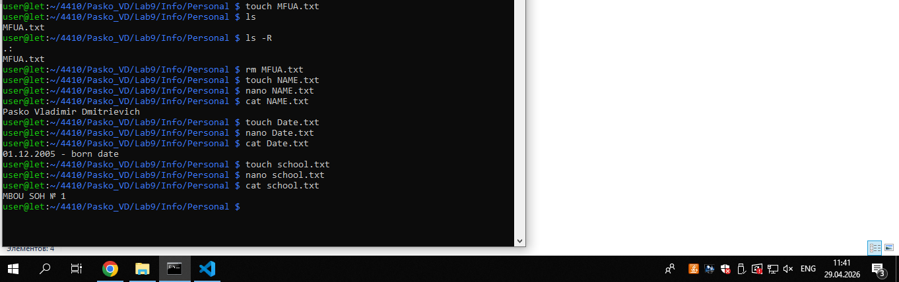

## Задание 4
В каталоге University создать файл Name.txt,
содержащий информацию о названии вуза и специальность, на
которой студент обучается. Здесь же создать файл Mark.txt с
оценками на вступительных экзаменах и общей суммой баллов.

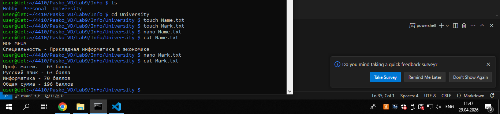

## Задание 5

В каталоге Hobby создать файл hobby.txt с
информацией об увлечениях студента

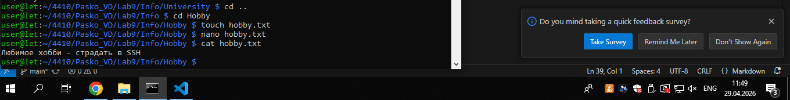

## Задание 6

Скопировать файл hobby.txt в каталог А2 и
переименовать его в файл Lab_№варианта.txt.

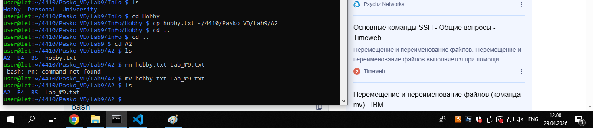

## Задание 7
Сделать копию файла Lab_№варианта.txt (например,
copy_Lab_№варианта.txt ) в этом же каталоге и удалить его

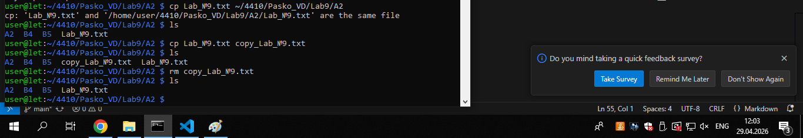

## Задание 8
Очистить экран от служебных записей
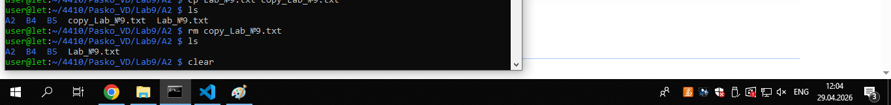

## Задание 9
Вывести на экран поочередно информацию,
хранящуюся во всех файлах каталога Personal

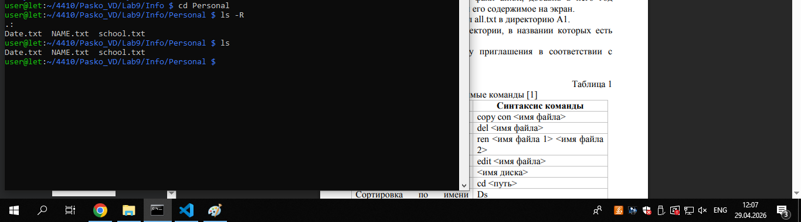

## Задание 10
Отсортировать все файлы, хранящиеся в каталоге
Personal, по имени

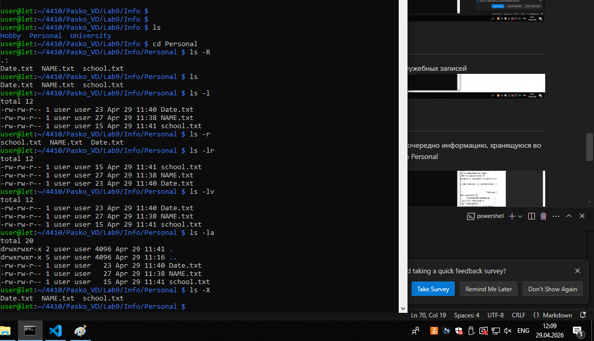

